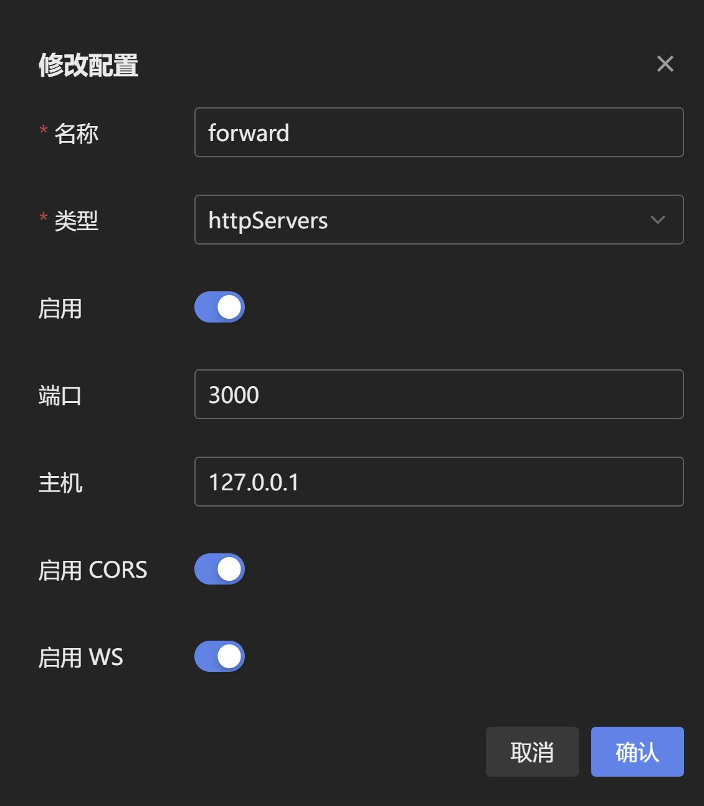
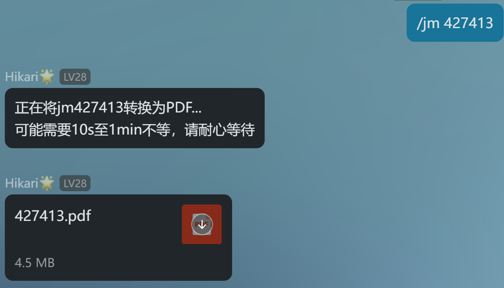
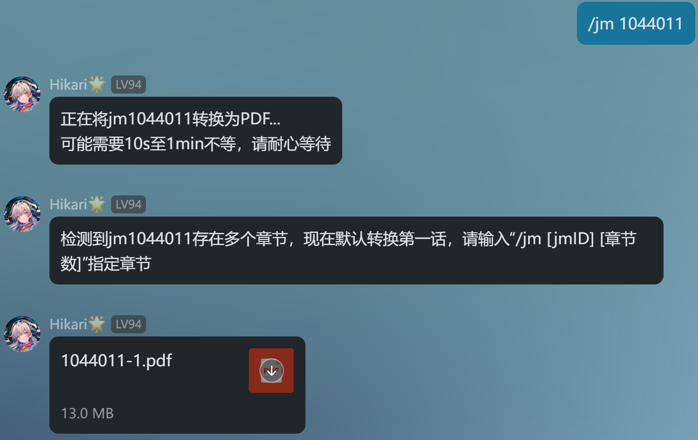
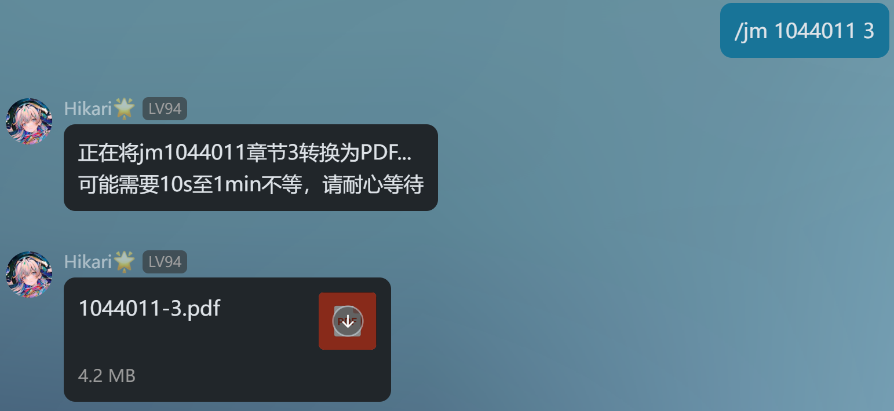

# JMcomic PDF Plugin

基于**langbot**与[image2pdf](https://github.com/salikx/image2pdf)的JM PDF插件🧩

## 使用方法❗

### 插件安装🛠️

配置完成 [QChatGPT](https://github.com/RockChinQ/QChatGPT) 主程序后使用管理员账号向机器人发送命令即可安装：

```
!plugin get https://github.com/AmethystTim/JM_PDF_plugin.git
```
或查看详细的[插件安装说明](https://github.com/RockChinQ/QChatGPT/wiki/5-%E6%8F%92%E4%BB%B6%E4%BD%BF%E7%94%A8)

### 网络配置🛜

在napcat消息平台中新增HTTP服务器，主机为`127.0.0.1`，端口为`3000`

<div align="center">



</div>

### 偏好配置🔧

修改`config.yml`中的`base_dir`为你自己实际的下载目录

```yaml
# Github Actions 下载脚本配置
version: '2.0'

dir_rule:
  base_dir: "C:\\Users\\Hello\\Desktop\\langbot\\plugins\\JM_PDF_plugin\\downloads" # 下载存储目录，要求为插件目录下downloads目录的绝对路径
  rule: Bd_Atitle_Pindex

download:
  cache: true
  image:
    decode: true
    suffix: .jpg
  threading:
    # batch_count: 章节的批量下载图片线程数
    # 数值大，下得快，配置要求高，对禁漫压力大
    # 数值小，下得慢，配置要求低，对禁漫压力小
    # PS: 禁漫网页一般是一次请求50张图
    batch_count: 45
```

### 指令🤖

|指令|参数|备注|
|-|-|-|
|`/jm`|||
|`/jm [jmID]`|`jmID`|`jmID`为漫画ID|
|`/jm [jmID] [chapter]`|`jmID` `chapter`|`chapter`为指定章节|

### 演示✨

#### 单章节漫画

<div align="center">



</div>

#### 多章节漫画

<div align="center">



</div>

<div align="center">



</div>

### 常见问题❓

|Q|A|
|-|-|
|插件加载失败？|请按照README中的安装步骤进行，并确保您的插件**目录名称**为`JM_PDF_plugin`|
|本子下载到本地后无法发出？|1. 可能是因为待下载漫画为长篇，下载全部章节所需时间过长，推荐下载短篇<br>2. 确保`config.yml`内`base_dir`为插件目录内`downloads`目录的**绝对路径**|
|加载插件失败？|检查是否安装依赖，一般是未安装`jmcomic`，使用`pip install jmcomic`安装即可|
|与`langbot`内置AI对话冲突？|issue [#4](https://github.com/AmethystTim/JM_PDF_plugin/issues/4)|

> 有其他问题欢迎提issue或在交流群讨论